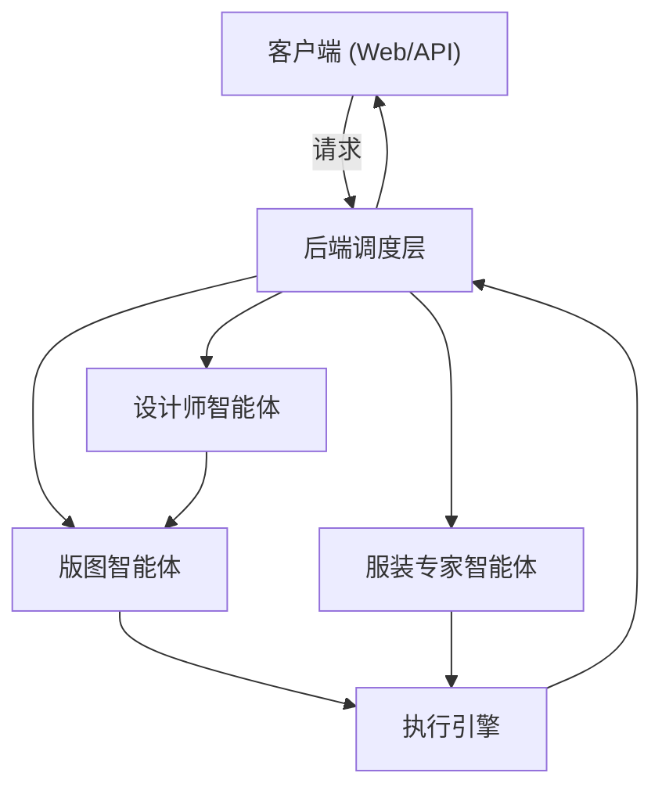

# Multimodal Input Conversion Layout Intelligent System

本项目是一套面向服装设计的多模态智能系统，支持“文本描述 + 草图输入 → 结构化服装属性与版图方案”的闭环流程。


【由于是课题项目，源码不公开，仅提供项目介绍，想获取源码或者数据集等，请私聊】

- 将文本或草图转成可制造的服装版图
- 支持服装风格识别、设计参数提取和版图生成
- 集成服装知识问答与潮流分析功能

[](https://python.org)
[](LICENSE)

## 目录

1. 项目简介
2. 核心能力
3. 系统架构
4. 模块说明
5. 数据流与工作流程
6. 运行方式
7. 项目目录
8. 技术栈
9. 发展方向

---

## 1. 项目简介

本系统使用多智能体协作与多模态大模型，将设计师输入的文本与草图信息，转换为可执行的服装设计参数和版图生成结果。

目标是：
- 降低服装设计表达门槛
- 将设计意图结构化为标准参数
- 支持自动化版图生成与服装知识问答

---

## 2. 核心能力

- 文本设计解析：把自然语言描述转成结构化服装参数
- 草图识别：把服装草图转成可训练的属性特征
- 版图生成：把结构化参数转成可制造的服装版图
- 服装问答：基于知识检索回答专业服装问题
- 潮流分析：结合历史数据进行风格趋势判断

---

## 3. 系统架构

系统由三层组成：

- 输入层：Web/API 前端接收文本与图像
- 协作层：后端调度智能体、管理任务状态
- 智能层：设计师智能体、版图智能体、服装专家智能体

### 架构图



---

## 4. 模块说明

### 4.1 设计师智能体

设计师智能体负责把设计输入转换为结构化英文描述，并与版图智能体协作完成代码生成。

- 文本设计模块：从中文描述中提取服装风格、版型、结构信息，并生成结构化英文段。
- 草图识别模块：从渲染图或手绘草图中提取服装属性，输出结构化英文段。

这两个模块对应的第一个微调模型是“草图识别大模型”，它的训练流程包括：
1. 读取服装渲染图（正面 / 背面）
2. HSV 分割去除人体区域
3. 清理残留噪声
4. 转换为手绘草图风格
5. 构建草图-结构英文段训练集

训练完成后，该模型还经过 DPO 强化学习优化。推理阶段只需输入手绘草图，就能直接生成结构化英文段。

### 4.2 版图智能体

版图智能体负责将结构化英文段转换为专业服装代码。

它对应的第二个微调模型，训练集由本人构建，训练目标是：
- 输入：结构化英文段
- 输出：专业服装代码

该模型的输入来源有两种：
- 草图识别智能体输出的结构化英文段
- 中文服装描述经过纯语言大模型 + 强提示词约束生成的结构化英文段

典型流程为：
- 结构化英文段输入
- 服装代码生成
- 结果用于版图/设计执行层

### 4.3 服装专家智能体

基于知识检索与生成，为设计师提供：

- 面料、剪裁、工艺问答
- 版型建议
- 潮流趋势判断

---

## 5. 数据流与工作流程

### 5.1 草图识别模型训练流程

第一个微调模型专注于“草图 → 结构化英文段”的映射，其训练数据构建过程为：

1. 读取服装渲染图（正面 / 背面）
2. HSV 分割去除人体区域
3. 清理残留噪声
4. 转换为手绘草图风格
5. 构建草图-结构英文段训练集

训练方式：
- 基础模型：Qwen2.5-VL-7B
- 微调方式：LoRA 参数高效微调
- 额外优化：DPO 强化学习

推理阶段：
- 直接输入手绘草图
- 输出结构化英文段

### 5.2 服装代码生成模型训练流程

第二个微调模型负责“结构化英文段 → 专业服装代码”的转换。

训练数据来源：
- 草图识别模型生成的结构化英文段
- 中文服装描述经纯语言大模型 + 强提示词约束生成的结构化英文段

训练目标：
- 输入：结构化英文段
- 输出：专业服装代码

### 5.3 推理与评估流程

两阶段推理路径：

- 草图输入路径：手绘草图 → 草图识别模型 → 结构化英文段 → 服装代码生成模型
- 文本输入路径：中文描述 → 纯语言大模型 + 强提示词 → 结构化英文段 → 服装代码生成模型

评估方式：
- 比较模型输出与期望结构化英文段或服装代码
- 统计准确率与结构化输出一致性

---

## 6. 运行方式

### 6.1 环境要求

- Python 3.10+
- PyTorch 2.0+
- 支持 GPU 的计算环境

### 6.2 安装依赖

```bash
pip install -r client_controller/requirements.txt
```

### 6.3 启动系统

```bash
python backend/run_backend.py
python client_controller/app.py
```

---

## 7. 项目目录

```text
Multimodal-Input-Conversion-Layout-Intelligent-System/
├── backend/                     # 后端调度与状态管理
├── client_controller/           # Web/API 客户端入口
├── intelligent_agents/          # 智能体实现
│   ├── designer/                # 设计师智能体模块
│   ├── pattern_maker/           # 版图智能体模块
│   ├── fashion_expert/          # 服装专家智能体模块
│   ├── blackboard/              # 黑板架构通信层
│   └── utils/                   # 公共工具库
├── lmm_utils/                   # 大模型工具与包装
├── assets/                      # 资源文件
├── model_config.py              # 模型与参数配置
└── README.md                    # 项目说明
```

---

## 8. 技术栈

| 层级 | 技术 |
|------|------|
| 前端 | Flask + Web API |
| 后端 | Python |
| 智能体通信 | 黑板架构 |
| 文本模型 | Qwen2.5 / 通义千问 API |
| 视觉模型 | Qwen2.5-VL-7B + LoRA |
| 检索库 | ChromaDB |
| 向量搜索 | BGE-M3 |

---

## 9. 发展方向

- 将草图识别流程拆分成“去人体 + 草图生成 + 属性提取”三个子模块
- 将版图生成模块与设计参数模块进一步解耦
- 增加可视化流程图和样例数据说明
- 加入更明确的“输入/输出格式规范”

---

## 10. 说明

本 README 已优化为“结构化说明 + 流程图 + 模块职责 + 运行指引”，便于开发人员快速理解系统架构和工程流程。本文一切权益属于jiangkang11134
